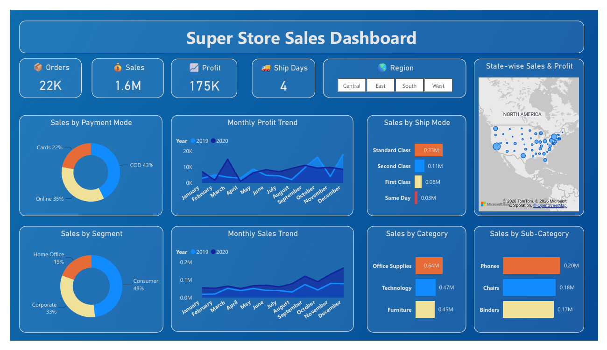

<h1 align="center">📊 Super Store Sales Dashboard</h1>

An interactive **Power BI Sales Analytics Dashboard** built to analyze sales performance, profitability, customer segments, shipping methods, and regional trends using the Super Store dataset.

---

## 📷 Dashboard Preview

<p align="center">

</p>

---

# 📌 Project Overview

This dashboard provides a comprehensive overview of sales performance across multiple business dimensions. It enables business stakeholders to monitor key performance indicators (KPIs), identify profitable categories, analyze customer purchasing behavior, and track monthly sales and profit trends.

The report is fully interactive with regional filtering, allowing users to explore business performance across different geographic regions.

---

# 🎯 Business Objectives

The dashboard was developed to answer the following business questions:

- What is the overall sales and profit performance?
- Which payment method contributes the highest sales?
- Which customer segment generates the most revenue?
- Which product categories perform best?
- Which sub-category generates the highest sales?
- How do monthly sales and profits change over time?
- Which shipping method is used the most?
- How do sales and profits vary across states?

---

# 📈 Key Performance Indicators (KPIs)

| KPI                  | Value |
| -------------------- | ----- |
| 📦 Total Orders      | 22K   |
| 💰 Total Sales       | 1.6M  |
| 📈 Total Profit      | 175K  |
| 🚚 Average Ship Days | 4     |

---

# 📊 Dashboard Features

### Executive KPI Cards

- Total Orders
- Total Sales
- Total Profit
- Average Shipping Days

### Interactive Filter

- Region Slicer
  - Central
  - East
  - South
  - West

### Sales Analysis

- Sales by Payment Mode
- Monthly Sales Trend
- Monthly Profit Trend
- Sales by Category
- Sales by Sub-Category
- Sales by Customer Segment
- Sales by Ship Mode
- Sales & Profit by State

---

# 🔍 Key Insights

- Consumer Segment contributes **48%** of total sales.
- COD is the most preferred payment method, contributing **43%** of total sales.
- Office Supplies is the highest-selling product category.
- Phones are the best-selling product sub-category.
- Standard Class is the most frequently used shipping method.
- Average shipping time is **4 days**.

---

# 🛠 Tools & Technologies

- Microsoft Power BI
- Power Query
- DAX
- Data Modeling
- Data Visualization

---

# 📂 Repository Structure

```
Super-Store-Sales-Dashboard/
│
├── Dataset/
│   └── SuperStore.csv
│
├── Images/
│   └── Dashboard.png
│
├── PowerBI/
│   └── Super_Store_Sales_Dashboard.pbix
│
├── README.md
├── LICENSE
└── .gitignore
```

---

# 📊 Dashboard Components

- KPI Cards
- Donut Charts
- Line Charts
- Bar Charts
- Map Visualization
- Region Slicer

---

# 💡 Skills Demonstrated

- Dashboard Design
- Business Intelligence
- Interactive Reporting
- DAX Measures
- Data Cleaning using Power Query
- Data Modeling
- Data Storytelling
- KPI Reporting

---

# 🚀 Future Improvements

- Add Year Filter
- Add Customer-Level Analysis
- Add Product-Level Drill Through
- Add Dynamic Tooltips
- Add Forecasting
- Improve Mobile Layout

---
